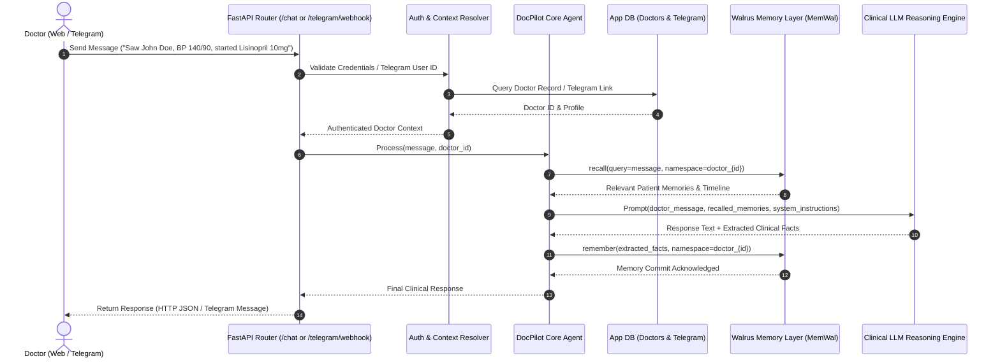

# DocPilot: Product Requirements Document (PRD) & Technical Architecture Specification

**Project:** DocPilot  
**Document Version:** 2.0.0 (Engineering & Implementation Spec)  
**Status:** Ready for Implementation  
**Runtime:** Python 3.11 / FastAPI / uv  
**Memory Subsystem:** Walrus Memory (`memwal`)  
**Target Repository:** `/home/ai-apostle/Projects/docpilot`  

---

## 1. Executive Summary & Vision

Traditional healthcare information systems require physicians to act as data-entry clerks, forcing clinical thoughts into rigid relational tables, checkboxes, and billing forms. 

**DocPilot** is an agentic, memory-first clinical assistant. Rather than maintaining a rigid `patients` database table, DocPilot enables patient entities and longitudinal health context to **emerge organically from natural clinical conversations**. 

Physicians interact with DocPilot across two primary surfaces:
1. **Web Dashboard (`POST /chat`)** for deep desk consultations, historical chart review, and documentation synthesis.
2. **Telegram Bot (`POST /telegram/webhook`)** for rapid, voice/text bedside notes and immediate queries on rounds.

Both interfaces feed directly into **DocPilot Core**, where conversation, semantic memory recall, clinical reasoning, and memory consolidation happen within isolated, doctor-specific Walrus memory namespaces.

---

## 2. Core Architectural Principles

### 2.1 The Emergent Patient Model
- **No Relational `patients` Table**: The database does not maintain a traditional static patient table for the MVP.
- **Organic Emergence**: When a physician says:
  > *"I just saw Maria Santos. She is 58, type 2 diabetic, presenting with a fasting glucose of 185. Starting Metformin 500mg BID."*
  DocPilot understands that Maria Santos is an active clinical entity, extracting her clinical state and persisting it into the doctor's Walrus memory namespace.
- **Contextual Recall & Updates**:
  > *"What did I start Maria on?"*
  DocPilot retrieves the latest treatment plan without requiring any SQL query on a patient table.
- **Disambiguation Engine**: If a doctor refers to *"John"*, and two distinct patients named John exist in memory, the system uses clinical context (age, condition, date of last visit) to ask a clarifying question:
  > *"Are you referring to John Doe (42, hypertension) or John Smith (67, COPD)?"*

### 2.2 Dual-Tier Data Separation

| Concern | Application Database (Identity Layer) | Walrus Memory Layer (`memwal`) |
| :--- | :--- | :--- |
| **Question Answered** | *"Who is the user and how do they connect?"* | *"What does the doctor remember about their patients?"* |
| **Entities Stored** | Doctors, Passwords, JWT Tokens, Telegram Links | Patients, Diagnoses, Meds, Allergies, Labs, Visits |
| **Engine** | Supabase PostgreSQL (Managed Relational DB) | Decentralized Persistent Memory (`MemWal` / `MemWalMock`) |
| **Isolation** | Row-level `doctor_id` foreign keys | Dedicated namespace: `doctor_{doctor_id}` |

---

## 3. System Architecture & Component Interaction



---

## 4. Database Design & Table Isolation

In compliance with [AGENTS.md](file:///home/ai-apostle/Projects/docpilot/AGENTS.md), each database table has its own dedicated SQL queries file under `backend/src/db/`. Queries across tables are never mixed.

### 4.1 Schema Definition

#### Table 1: `doctors`
- **File**: `backend/src/db/doctors_queries.py`
```sql
CREATE TABLE IF NOT EXISTS doctors (
    id TEXT PRIMARY KEY,
    email TEXT UNIQUE NOT NULL,
    hashed_password TEXT NOT NULL,
    full_name TEXT,
    created_at TIMESTAMP DEFAULT CURRENT_TIMESTAMP,
    updated_at TIMESTAMP DEFAULT CURRENT_TIMESTAMP
);

CREATE INDEX IF NOT EXISTS idx_doctors_email ON doctors(email);
```

#### Table 2: `telegram_connections`
- **File**: `backend/src/db/telegram_queries.py`
```sql
CREATE TABLE IF NOT EXISTS telegram_connections (
    id TEXT PRIMARY KEY,
    doctor_id TEXT UNIQUE NOT NULL,
    telegram_user_id INTEGER UNIQUE NOT NULL,
    telegram_username TEXT,
    is_active INTEGER DEFAULT 1,
    connected_at TIMESTAMP DEFAULT CURRENT_TIMESTAMP,
    FOREIGN KEY(doctor_id) REFERENCES doctors(id) ON DELETE CASCADE
);

CREATE INDEX IF NOT EXISTS idx_tg_user_id ON telegram_connections(telegram_user_id);
CREATE INDEX IF NOT EXISTS idx_tg_doctor_id ON telegram_connections(doctor_id);
```

### 4.2 Database Strategy
- **Primary Engine**: Supabase PostgreSQL managed database, accessed via async Supabase client (`src/client/supabase_client.py` and `src/client/db.py`).
- **Query Isolation**: 
  - `doctors_queries.py`: `create_doctor`, `get_doctor_by_email`, `get_doctor_by_id`.
  - `telegram_queries.py`: `create_connection`, `get_connection_by_telegram_id`, `delete_connection`.
  - `chat_sessions_queries.py`: `create_session`, `get_session_by_id`, `list_sessions_by_doctor_id`.
  - `chat_messages_queries.py`: `create_message`, `get_messages_by_session_id`.

---

## 5. Walrus Memory (`memwal`) Integration Specification

### 5.1 Client Architecture (`backend/src/client/walrus.py`)
The Walrus client encapsulates all interactions with the decentralized memory system:
- **Production Mode**: Uses `memwal.MemWal.create(...)` with the doctor's Ed25519 delegate key, account ID, and relayer environment (`ENV_PRESETS["dev"]` or `"prod"`).
- **Development/Mock Mode**: Uses `memwal.MemWalMock()` for offline local testing and continuous integration without requiring active network connectivity or credentials.

### 5.2 Namespace & Memory Segregation
- Each doctor's memory space is strictly scoped:
  ```python
  def get_doctor_namespace(doctor_id: str) -> str:
      return f"doctor_{doctor_id}"
  ```
- Memory recall strictly enforces the doctor's namespace:
  ```python
  memories = await walrus_client.recall(
      query=user_query,
      namespace=get_doctor_namespace(doctor_id),
      limit=5,
      min_relevance=0.35
  )
  ```

### 5.3 Clinical Fact Ingestion Strategy
When clinical notes or visit updates are processed:
1. The AI extracts discrete clinical assertions:
   - Patient Name & Demographics
   - Subjective / Objective observations (Vitals, Symptoms, Lab values)
   - Assessment / Plan (Diagnoses, Medication changes, Allergies)
2. The agent commits structured facts to Walrus:
   ```python
   await walrus_client.remember(
       content=formatted_clinical_delta,
       namespace=get_doctor_namespace(doctor_id)
   )
   ```

---

## 6. Detailed Backend Directory Structure

Following the boundary and client rules in [backend/AGENTS.md](file:///home/ai-apostle/Projects/docpilot/backend/AGENTS.md):

```
backend/
├── pyproject.toml               # uv configuration (package = false, python >=3.11)
├── .python-version              # 3.11
├── README.md
├── AGENTS.md                    # Backend guidelines & isolation rules
├── agent.md -> AGENTS.md        # Symlink
├── main.py                      # FastAPI application entrypoint & middleware
└── src/
    ├── __init__.py
    ├── agent/                   # DocPilot Core Reasoning & Prompts
    │   ├── __init__.py
    │   ├── core.py              # Central agent coordinator
    │   ├── prompts.py           # Clinical prompt engineering & formatting
    │   └── memory_extractor.py  # Structured entity & clinical fact extraction
    ├── auth/                    # Security, Hashing, JWT Tokens
    │   ├── __init__.py
    │   ├── jwt.py               # Token creation, decoding, and validation
    │   ├── security.py          # Password hashing (Argon2 / bcrypt)
    │   └── dependencies.py      # FastAPI Depends(get_current_doctor)
    ├── client/                  # External service clients (Single Responsibility)
    │   ├── __init__.py
    │   ├── db.py                # Database connection factory (SQLite / LibSQL)
    │   ├── llm.py               # OpenRouter LLM Client (OpenAI SDK with base_url=https://openrouter.ai/api/v1)
    │   └── telegram.py          # Telegram Bot API client (sendMessage, setWebhook)
    ├── memory/                  # Walrus Memory Subsystem
    │   ├── __init__.py
    │   └── walrus.py            # Walrus Memory (MemWal / MemWalMock wrapper, namespace management)
    ├── db/                      # Database Table Queries (Strictly 1 file per table)
    │   ├── __init__.py
    │   ├── schema.py            # Database initialization & migrations
    │   ├── doctors_queries.py   # Isolated SQL queries for 'doctors' table
    │   ├── telegram_queries.py  # Isolated SQL queries for 'telegram_connections' table
    │   ├── chat_sessions_queries.py  # Isolated SQL queries for 'chat_sessions' table
    │   └── chat_messages_queries.py  # Isolated SQL queries for 'chat_messages' table
    ├── schemas/                 # Pydantic v2 Request/Response Models (Strictly 1 file per domain)
    │   ├── __init__.py
    │   ├── doctor.py            # Doctor registration, login, profile schemas
    │   ├── token.py             # JWT token response and payload schemas
    │   ├── clinical_entity.py   # Clinical entity categories, extraction schemas
    │   ├── attachment.py        # Document, image, and voice attachment schemas
    │   ├── chat_session.py      # Session creation, listing, and metadata schemas
    │   ├── chat_message.py      # Historical message item schemas
    │   ├── chat.py              # ChatRequest, ChatResponse schemas
    │   └── telegram.py          # Telegram connection and webhook schemas
    └── pages/                   # FastAPI APIRouters (Endpoint Handlers)
        ├── __init__.py
        ├── auth.py              # /auth/register, /auth/login, /auth/me
        ├── chat.py              # /chat, /chat/sessions, /chat/sessions/{id}/messages
        └── telegram.py          # /telegram/connect, /telegram/webhook
```

---

## 7. API Specifications & Data Contracts

### 7.1 Authentication Endpoints (`src/pages/auth.py`)

#### `POST /auth/register`
- **Request Body**:
  ```json
  {
    "email": "dr.smith@hospital.org",
    "password": "SecurePassword123!",
    "full_name": "Dr. Sarah Smith, MD"
  }
  ```
- **Response (201 Created)**:
  ```json
  {
    "doctor_id": "doc_9f83b2e1",
    "email": "dr.smith@hospital.org",
    "full_name": "Dr. Sarah Smith, MD",
    "access_token": "eyJhbGciOi...",
    "token_type": "bearer"
  }
  ```

#### `POST /auth/login`
- **Request Body**:
  ```json
  {
    "email": "dr.smith@hospital.org",
    "password": "SecurePassword123!"
  }
  ```
- **Response (200 OK)**:
  ```json
  {
    "access_token": "eyJhbGciOi...",
    "token_type": "bearer",
    "doctor": {
      "id": "doc_9f83b2e1",
      "email": "dr.smith@hospital.org",
      "full_name": "Dr. Sarah Smith, MD"
    }
  }
  ```

---

### 7.2 Chat, Sessions & Multimodal Interaction (`src/pages/chat.py`)

#### `GET /chat/sessions`
Returns recent consultation sessions for the authenticated doctor (used for Home Chat sidebar/dashboard).
- **Headers**: `Authorization: Bearer <JWT>`
- **Response (200 OK)**:
  ```json
  [
    {
      "id": "sess_a1b2c3d4",
      "title": "Consultation with John Doe",
      "created_at": "2026-10-04T14:30:00Z",
      "updated_at": "2026-10-04T15:00:00Z",
      "message_count": 8
    }
  ]
  ```

#### `POST /chat/sessions`
Creates a new clinical consultation session.
- **Headers**: `Authorization: Bearer <JWT>`
- **Request Body**:
  ```json
  {
    "title": "Maria Santos - Initial Diabetes Review"
  }
  ```
- **Response (201 Created)**: Returns the newly created session.

#### `GET /chat/sessions/{session_id}/messages`
Retrieves conversation history and attached documents/images for a specific session.
- **Headers**: `Authorization: Bearer <JWT>`
- **Response (200 OK)**: List of messages with role (`doctor` or `assistant`), content, and attachments.

#### `POST /chat`
Central clinical message ingestion supporting text and optional multimodal attachments (documents, images, or audio voice transcriptions).
- **Headers**: `Authorization: Bearer <JWT>`
- **Request Body**:
  ```json
  {
    "session_id": "sess_a1b2c3d4",
    "message": "Saw John Doe today. BP 150/92, attached lab results showing HbA1c 7.4%. Increased amlodipine to 10mg daily.",
    "attachments": [
      {
        "filename": "lab_report_hba1c.pdf",
        "file_type": "application/pdf",
        "content_base64": "JVBERi0xLjQK...",
        "description": "Metabolic panel and HbA1c labs"
      }
    ]
  }
  ```
- **Response (200 OK)**:
  ```json
  {
    "session_id": "sess_a1b2c3d4",
    "response": "Documented visit for John Doe: Noted blood pressure 150/92 mmHg and reviewed attached lab report showing elevated HbA1c at 7.4%. Increased amlodipine to 10mg daily and noted diabetic management follow-up.",
    "action_taken": "update_memory",
    "entities_extracted": [
      {
        "patient_name": "John Doe",
        "category": "vital_sign",
        "detail": "BP 150/92 mmHg"
      },
      {
        "patient_name": "John Doe",
        "category": "lab_result",
        "detail": "HbA1c 7.4%"
      },
      {
        "patient_name": "John Doe",
        "category": "medication_change",
        "detail": "Amlodipine increased to 10mg daily"
      }
    ]
  }
  ```


---

### 7.3 Telegram Webhook & Integration Endpoints (`src/pages/telegram.py`)

#### `POST /telegram/connect`
- **Headers**: `Authorization: Bearer <JWT>`
- **Request Body**:
  ```json
  {
    "telegram_user_id": 987654321,
    "telegram_username": "dr_smith"
  }
  ```
- **Response (200 OK)**:
  ```json
  {
    "status": "connected",
    "doctor_id": "doc_9f83b2e1",
    "telegram_user_id": 987654321
  }
  ```

#### `POST /telegram/webhook`
- **Headers**: `X-Telegram-Bot-Api-Secret-Token: <SECRET_TOKEN>`
- **Request Body**: Standard Telegram Update payload.
- **Workflow**:
  1. Verifies secret token header.
  2. Extracts `message.from.id` and `message.text`.
  3. Queries `telegram_connections` table to resolve `doctor_id`.
  4. If unlinked, replies with registration/linking prompt.
  5. If linked, executes `DocPilotCore.process(message, doctor_id)`.
  6. Dispatches synthesized answer back to Telegram via `telegram_client.send_message`.
  7. Returns HTTP `200 OK`.

---

## 8. Clinical Prompting & Agent Pipeline

### 8.1 System Prompt Architecture
```text
You are DocPilot, an elite clinical AI assistant designed specifically for physicians.
You operate with a persistent memory of the doctor's patients and historical consultations.

Guidelines:
1. Accuracy & Conciseness: Provide precise clinical summaries, highlighting medications, dosages, allergies, and diagnoses.
2. Emergent Patient Context: Information between <RECALLED_MEMORIES> represents previously documented clinical notes for this doctor.
3. Memory Delta Extraction: Always output both:
   a) A natural, respectful clinical response to the physician.
   b) A structured list of updated clinical facts to commit to memory.
4. Ambiguity Resolution: If the doctor's query refers to a patient name that matches multiple distinct clinical files, ask for brief clarification referencing differentiating details (age, primary condition, recent visit).
```

---

## 9. Phased Implementation Roadmap

### Phase 1: Foundation & Infrastructure (Immediate Step)
1. **Pydantic Schemas** (`src/schemas/auth.py`, `src/schemas/chat.py`, `src/schemas/telegram.py`).
2. **Database Engine & Isolated Queries**:
   - `src/client/db.py` (connection manager).
   - `src/db/schema.py` (schema creation).
   - `src/db/doctors_queries.py` (doctors SQL queries).
   - `src/db/telegram_queries.py` (telegram connections SQL queries).
3. **Authentication & Security**:
   - `src/auth/security.py`, `src/auth/jwt.py`, `src/auth/dependencies.py`.
   - `src/pages/auth.py` router.

### Phase 2: Memory & Clinical Agent Integration
1. **Walrus Client** (`src/client/walrus.py`):
   - Wrap `MemWal` / `MemWalMock` with fallback and namespace isolation.
2. **LLM Client** (`src/client/llm.py`):
   - Async completion with structured clinical fact extraction.
3. **DocPilot Core Agent** (`src/agent/core.py`, `src/agent/prompts.py`).
4. **Chat Endpoint** (`src/pages/chat.py`).

### Phase 3: Telegram Bot Integration
1. **Telegram Client** (`src/client/telegram.py`):
   - Secure webhook dispatcher and reply sender.
2. **Telegram Router** (`src/pages/telegram.py`):
   - `/telegram/connect`, `/telegram/webhook`, `/telegram/disconnect`.

### Phase 4: Verification & End-to-End Testing
1. Multi-turn clinical conversation test (Patient emergence -> Follow-up recall -> Medication adjustment).
2. Telegram webhook simulation test.
3. Disambiguation behavior test with duplicate patient names.
